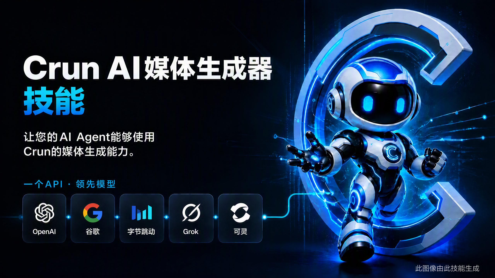

# Crun Agent Skills


一套开源的 **AI 媒体生成技能包**，基于 [Crun](https://crun.ai/zh) API 构建，让 AI Agent 能够自主完成**图片、视频、语音、音乐
**的生成任务：模型路由、额度预估、任务创建、状态轮询、结果下载全流程闭环，由内置的零依赖 Python cli 脚本驱动。

技能覆盖 100+ 个模型，横跨多家厂商，包括 Seedance 2.0、GPT-Image、Nano Banana、Veo 3.1、Grok Imagine、Kling v3、Sora
2、Seedream、FLUX、Qwen-Image、Wan 2.7、Vidu Q3、Suno API、Qwen3-TTS 等。

[快速开始](#快速开始) | [核心特性](#核心特性) | [工作原理](#工作原理) | [示例提示词](#示例提示词) | [模型覆盖](#模型覆盖) | [命令参考](#核心命令cli) | [English README](./README.md)

---

## 核心特性

- 🧭 **基于意图的模型路由**：把一句自然语言需求（"做个 10 秒的产品视频"）归一化成结构化意图，LLM从模型列表中挑选最合适的模型，用户无需知道任何模型名。
- 💳 **每次任务前的额度闸门**：任何任务都先做预估，只有返回 `affordable: true` 才允许创建，避免格式错误或额度不足的提交白白扣费。
- 🔁 **可靠的异步任务生命周期**：`CreateTask` 永不自动重试（不会重复扣费）；`task_id` 全程留存并可用 `task wait`
  断点续查；超时会返回可恢复的现场快照，而不是盲目重新提交。
- 📤 **本地素材上传**：通过预签名 URL 上传本地图片、视频、音频，拿到可复用的 Crun 资源地址。
- 🪶 **零第三方依赖**：运行时只是一个 Python 3.9+ 标准库 CLI（`runtime/crun_cli.py`），无需额外安装第三方依赖。
- 🧩 **支持多个厂商模型**：支持 ByteDance、Google、OpenAI、可灵、Vidu、阿里通义、MiniMax、Runway、Suno、xAI 等 15+ 家厂商的 138
  个模型，一套工作流通吃图片、视频、语音、音乐。
- 🌍 **多 Agent 平台通用**：同一份技能装到 Claude Code、Codex、OpenClaw、Cursor、WorkBuddy 等任何支持 SKILL.md
  约定的平台都能直接工作，无需按平台改写。

---

## 工作原理

仓库是一个可组合的技能包：一个入口技能 + 三个核心流程子技能 + 一组持续扩充的场景技能（场景技能内部复用核心流程）。

```text
crun-agent-skills/
├── SKILL.md                          # 入口：编排流程与安全约束
├── runtime/
│   └── crun_cli.py                   # 独立 CLI（上传、路由、预估、创建、轮询、下载）
├── catalog/
│   └── models.json                   # 本地模型目录（能力标签与路由优先级）
├── agents/
│   └── openai.yaml                   # Agent 接口元信息
├── skills/
│   ├── crun-model-router/            # 核心：从结构化意图选择并查询模型
│   ├── crun-account-credits/         # 核心：余额查询与可负担性预估
│   ├── crun-task-runner/             # 核心：任务创建、监控、恢复、结果交付
│   └── scenarios/                    # 场景技能 —— 按用户意图触发，内部组合核心流程
│       ├── crun-meme-generator/          # 静态表情包与动态 GIF 表情包生成（带视频转 GIF 转换）
│       ├── crun-educational-comic/       # 多格教育漫画与分镜生成
│       ├── crun-media-enhancer/          # 视频、图片增强
│       ├── crun-action-camera-enhancer/  # 角色动作、姿势动能与运镜拆解增强（支持文生图/图生图/文生视频/图生视频）
│       ├── crun-character-reference/     # 角色参考图（九宫格、三视图、表情图等）
│       ├── crun-photo-replication/          # 照片复刻与跨画风重构（同款替换、老照片高清修复、姿势复刻等）
│       ├── crun-effect-template/          # 获取并调用 Kling、Vidu、ByteDance 特效模板
│       └── crun-url-promo-generator/      # 根据网页/商品 URL 提取卖点并生成宣传海报与视频广告
```

一个完整的端到端请求会依次经过：

1. **判定**输出模态与操作类型，只收集不可或缺的输入。
2. **上传**新的本地素材（`crun_cli.py upload`），已有的 Crun 资源地址直接复用。
3. **路由**：用户没指定模型时交给 `crun-model-router`，随后拉取该模型的线上输入 schema。
4. **预估**：用最终确定的输入调 `crun-account-credits`，要求 `affordable: true`；路由出来的模型需向用户确认后再花费额度。
5. **只创建一次**，记录 `task_id`，用 `task wait` 分多轮短超时轮询。
6. **交付**归一化结果：本地路径、远端 URL、消耗额度、用量信息。

---

## 支持的平台

任何遵循 SKILL.md 约定的 Agent 平台都能使用，包括但不限于：

- Claude Code
- Codex
- OpenClaw
- Claude Cowork
- Cursor
- WorkBuddy
- Antigravity
- 其他支持 skill 的 Agent 平台

---

## 快速开始

### 第一步：安装

Vibe 安装 —— 直接把下面这句发给你的 AI：

```text
帮我安装这个技能，使用命令 `npx skills add CrunTeam/crun-agent-skills --all`
```

或者用 skills CLI 手动安装：

```bash
# 查看这个仓库里可安装的内容
npx skills add CrunTeam/crun-agent-skills --list

# 全部安装
npx skills add CrunTeam/crun-agent-skills --all

# 全局安装（用户级）
npx skills add CrunTeam/crun-agent-skills -g
```

也可以直接 clone 到 Agent 的 skills 目录（以 Claude Code 为例）：

```bash
git clone https://github.com/CrunTeam/crun-agent-skills.git ~/.claude/skills/crun-agent-skills
```

### 第二步：配置 API Key

在这里获取你的 Crun API Key：https://crun.ai/zh/user-api-key （格式：`ak_` 加 32 位字符），然后用 CLI 内置的配置命令一次性写入：

```bash
python runtime/crun_cli.py config set-api-key <your_api_key>
```

该命令会校验 Key 格式并持久化到 `~/.crun/.env`，之后每个新终端都能自动读取。也可以自行设置 `CRUN_API_KEY` 环境变量。

运行时按以下顺序解析密钥：`~/.crun/.env` → `CRUN_API_KEY` 环境变量。如果没有配置任何密钥，每条命令都会返回
`configuration_options`，其中推荐项就是已填好脚本绝对路径、可直接执行的 `config set-api-key` 配置命令。

如需指向非默认 API 端点，可另行设置 `CRUN_BASE_URL`。

### 第三步：验证

```bash
python runtime/crun_cli.py credits
```

能看到数字形式的额度余额，就说明一切就绪。

---

## 🧠 示例提示词

可以直接把下面这些粘进 Agent 对话，也可以只用自然语言描述你想要的媒体——即使从未提到 "Crun" 或任何模型名，技能也会被触发。

#### A) 生成图片

```text
使用 $crun-agent-skills 为智能手表落地页生成一张主视觉图：
极简产品特写，柔和影棚灯光，16:9。
先报价额度，完成后展示本地文件。
```

#### B) 指定参数生成图片

```text
使用 $crun-agent-skills 生成一张图片：
- model: google/nano-banana-pro
- prompt: 一只跳舞的可爱小猫，3D 卡通风格，动感全身，干净的舞台背景
- options: aspect_ratio=16:9, resolution=2k
返回任务 ID、最终状态和本地文件路径。
```

#### C) 编辑本地图片

```text
使用 $crun-agent-skills 去掉 ./product.png 的背景，
并把产品放到干净的渐变底上。
```

#### D) 生成视频（自动路由模型）

```text
使用 $crun-agent-skills 生成一段 10 秒的电影感无人机镜头：
日出时分的未来城市，带原生音频，质量与速度均衡。
创建任务前先报告选中的模型和预估额度。
```

#### E) 指定参数生成视频

```text
使用 $crun-agent-skills 生成一段视频：
- model: bytedance/seedance2-0-t2v
- prompt: 日出时分未来城市的电影感大远景，流畅的无人机运镜
- options: duration=10, resolution=720p
返回任务 ID 和最终视频文件。
```

#### F) 指定模型的图生视频

```text
使用 $crun-agent-skills，用 bytedance/seedance2-0-i2v 模型，
把 ./keyframe.png 动画化成流畅的 5 秒短片。
```

#### G) 生成语音或音乐

```text
使用 $crun-agent-skills 把这段文字合成为自然的语音："..."
```

```text
使用 $crun-agent-skills 生成一首温暖的 lo-fi 纯音乐学习曲。
```

#### H) 预估消耗、查询余额或续查任务

```text
使用 $crun-agent-skills 在提交前预估这个请求的额度消耗：
- model: google/nano-banana-pro
- prompt: 智能手表的极简产品海报
- options: aspect_ratio=1:1, resolution=1K
返回 estimated_credits 和 affordable，不要创建任务。
```

```text
使用 $crun-agent-skills 查询我当前的 Crun 额度余额。
```

```text
使用 $crun-agent-skills 续查任务 <task_id> 并下载结果。
```

---

## 模型覆盖

路由候选来自 [`catalog/models.json`](./catalog/models.json)——本地模型目录，收录 138
个模型的模态、支持的操作、质量/速度档位、参考素材支持、原生音频支持和路由优先级；`models list` 还可以直接调取远程的最新模型列表。概览：

| 模态    | 模型家族                                                                                                                                                        | 操作                                                                                                                   |
|-------|-------------------------------------------------------------------------------------------------------------------------------------------------------------|----------------------------------------------------------------------------------------------------------------------|
| 图片    | Seedream 5/4.5/4、GPT-Image 2/1.5/1、Nano Banana / Pro / 2、FLUX 1.1/2/Kontext、Qwen-Image 2.0、Wan 2.6/2.7 Image、Grok Imagine、z-image                           | `text-to-image`、`image-edit`                                                                                         |
| 视频    | Seedance 2.0/1.5/1.0、Sora 2 / Sora 2 Pro、Veo 3.1（fast/lite/quality）、Kling v2.x/v3、Vidu Q1–Q3、Wan 2.5–2.7、Hailuo、Runway Gen-4、HappyHorse 1.0/1.1、Gemini Omni | `text-to-video`、`image-to-video`、`reference-to-video`、`first-last-frame-to-video`、`storyboard-to-video`、`video-edit` |
| 音频与音乐 | Qwen3-TTS（语音合成、声音克隆、音色设计）、Suno（音乐生成/翻唱/续写、音效、人声分离）                                                                                                          | `text-to-speech`、`music-generate`、`sound-effects`、`vocal-separation`                                                 |
| 媒体工具  | 图片超分、背景移除、水印移除、视频增强、口型同步（Vidu）、动作控制（Kling、DreamActor、Wan Animate）、视频模板                                                                                      | `image-upscale`、`background-remove`、`watermark-remove`、`lip-sync`、`motion-control`、`template-to-video`               |

本地目录只负责路由标签与优先级；某个模型当前的输入 schema 始终以鉴权后的 Models 接口为准（`models describe`）。

查看 Crun 全部模型详情：https://crun.ai/zh/models  
各模型的具体定价：https://crun.ai/zh/pricing

---

## 核心命令（CLI）

所有命令都向 stdout 输出一个 JSON 对象、向 stderr 输出 JSON 错误——为 Agent 设计，人类也能直接用。

```bash
# 账户
# 初始化 API 密钥
python runtime/crun_cli.py config set-api-key <your_api_key>
# 查询账户额度余额
python runtime/crun_cli.py credits

# 模型
# 调取远程最新模型列表
python runtime/crun_cli.py models list
# 离线读取本地模型目录，不发起网络请求
python runtime/crun_cli.py models list --local
# 查询指定模型的输入参数要求（schema）
python runtime/crun_cli.py models describe --model google/nano-banana-pro
# 按结构化意图从本地目录路由模型
python runtime/crun_cli.py models route --intent-file intent.json

# 特效模板
# 分页获取指定平台模板
python runtime/crun_cli.py templates list --platform kling --page 1 --page-size 20
# 按模板 ID 精确查询；CLI 会自动适配 Vidu 不同的接口参数名
python runtime/crun_cli.py templates list --platform vidu --template-id <template_id>

# 素材上传
# 上传本地图片/视频/音频
python runtime/crun_cli.py upload ./reference.png

# 任务生命周期
# 预估额度消耗，不创建任务
python runtime/crun_cli.py task estimate --model <model> --input-file input.json
# 创建任务并立即返回 task_id，扣费操作
python runtime/crun_cli.py task create --model <model> --input-file input.json
# 查询一次任务状态，已完成则顺带下载媒体
python runtime/crun_cli.py task status --task-id <task_id>
# 轮询任务直到完成或超时
python runtime/crun_cli.py task wait --task-id <task_id> --timeout-seconds 120

# 一步到位的兼容命令（会直接创建任务；请先自行预估并确认）
# 创建 + 轮询 + 下载一步完成
python runtime/crun_cli.py task run --model <model> --input-file input.json
# 路由 + 创建 + 轮询 + 下载一步完成
python runtime/crun_cli.py media run --intent-file intent.json --input-file input.json
```

路由意图的结构：

```json
{
  "modality": "image|video|audio",
  "operation": "text-to-image|image-edit|text-to-video|image-to-video|text-to-speech|music-generate|...",
  "quality": "balanced|best",
  "speed": "balanced|fast",
  "native_audio": false,
  "reference_media": []
}
```

---

## 安全与可靠性

技能指令内置以下护栏：

- **不盲目花钱**：每个任务（包括用户点名模型的任务）创建前都会校验可负担性；路由选出的模型必须连同预估额度一起经用户明确确认。
- **不重复扣费**：`CreateTask` 永不自动重试；只有安全的读请求（`TaskInfo`、模型列表）会在瞬时故障时重试。
- **不悄悄改动**：Agent 绝不会在不告知的情况下更换模型或丢弃被拒绝的输入字段。
- **敏感媒体策略**：变换真人面孔或声音、移除水印之前，必须确认用户拥有素材或已获授权；冒充、欺诈及未经同意的内容一律拒绝。
- **密钥卫生**：API Key 绝不出现在任务 payload、打印输出或提交的文件中（`.env` 已被 gitignore）。

---

## 参与贡献

欢迎贡献——发现 Bug 或有功能想法请提 Issue，也欢迎提交 PR 改进运行时、本地模型目录、技能指令或平台适配。新增或更新目录条目时，请显式声明能力和路由优先级，切勿从模型名或
schema 推断。

如果这个项目对你有帮助，欢迎点个 Star。

---

## 协议

本项目采用 MIT 许可证 —— 见 [LICENSE](./LICENSE)。
