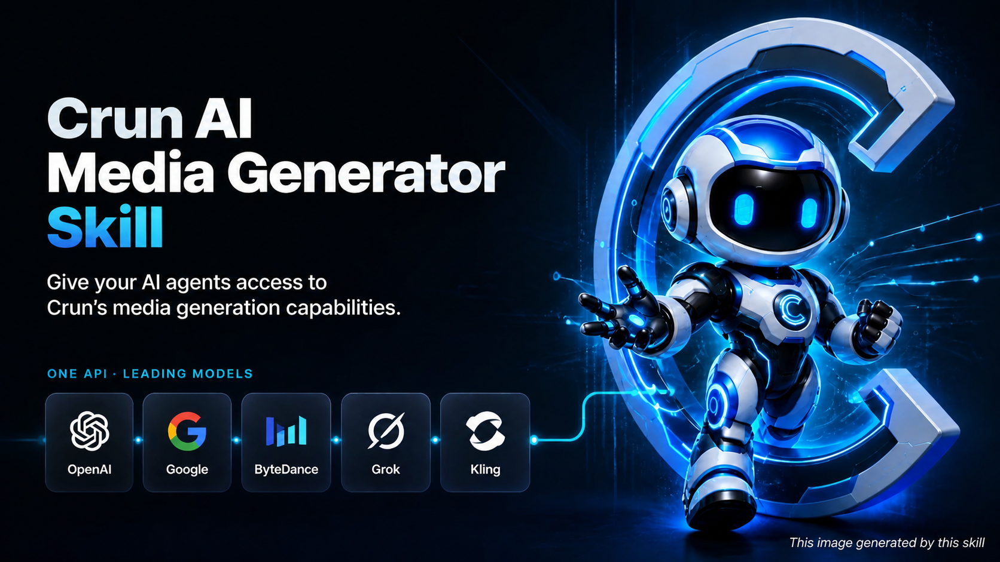

# Crun Agent Skills


An open-source **AI media generation skill set** for AI agents, built on the [Crun](https://crun.ai/zh) API. It lets
your agent route, estimate, create, monitor, and retrieve **image, video, speech, and music** generation tasks on its
own — through a bundled, dependency-free Python runtime.

The skill covers 100+ models across providers, including Seedance 2.0, GPT-Image, Nano Banana, Veo 3.1, Grok Imagine,
Kling v3, Sora 2, Seedream, FLUX, Qwen-Image, Wan 2.7, Vidu Q3, Suno API, and Qwen3-TTS.

[Quick Start](#quick-start) | [Key Features](#key-features) | [How It Works](#how-it-works) | [Example Prompts](#example-prompts) | [Model Coverage](#model-coverage) | [CLI Reference](#core-commands-cli) | [中文文档](./README-zh.md)

---

## Key Features

- 🧭 **Intent-based model routing**: the agent normalizes a plain-language request ("make me a 10s product video") into a
  structured intent and picks the best model from the model list — no need to know model names.
- 💳 **Credit gate before every task**: every task is estimated first; creation only proceeds when the estimate reports
  `affordable: true`, so a malformed or unaffordable submission never wastes a real charge.
- 🔁 **Safe async task lifecycle**: `CreateTask` is never auto-retried (no duplicate charges), task IDs are captured and
  resumable with `task wait`, and timeout recovery snapshots let the agent continue instead of re-submitting.
- 📤 **Local media upload**: upload local images, videos, or audio via presigned URLs and get back a reusable Crun
  resource URL.
- 🪶 **Zero dependencies**: the runtime is a single Python 3.9+ standard-library CLI (`runtime/crun_cli.py`) — nothing to
  `pip install`.
- 🧩 **Multi-provider model support**: support 138 models from 15+ provider — ByteDance, Google, OpenAI, Kling, Vidu,
  Alibaba Qwen/Wan, MiniMax, Runway, Suno, xAI, and more — with one workflow covering image, video, speech, and music.
- 🌍 **Compatible with multiple Agent platforms**: the same skill runs unchanged on Claude Code, Codex, OpenClaw, Cursor,
  WorkBuddy and any other platform that follows the SKILL.md convention — no per-platform rewrites.

---

## How It Works

The repository is a composable skill package with one entry skill, three core pipeline skills, and a growing set of
scenario skills that compose them:

```text
crun-agent-skills/
├── SKILL.md                          # Entry point: orchestration & safety rules
├── runtime/
│   └── crun_cli.py                   # Standalone stdlib-only CLI (upload, route, estimate, create, wait, download)
├── catalog/
│   └── models.json                   # Local model catalog (capability labels & routing priorities)
├── agents/
│   └── openai.yaml                   # Agent interface metadata
├── skills/
│   ├── crun-model-router/            # Core: pick & inspect a model from a structured intent
│   ├── crun-account-credits/         # Core: balance check & affordability estimation
│   ├── crun-task-runner/             # Core: task creation, monitoring, recovery, result delivery
│   └── scenarios/                    # Scenario skills — matched by user intent, built on the core pipeline
│       ├── crun-meme-generator/          # Static & animated GIF meme generator (with MP4 to GIF converter)
│       ├── crun-educational-comic/       # Multi-panel educational comics & storyboards
│       ├── crun-media-enhancer/          # Enhance videos and images
│       ├── crun-action-camera-enhancer/  # Character action, pose dynamics & camera motion director (T2I, I2I, T2V, I2V)
│       ├── crun-character-reference/     # Character reference sheet (nine-grid, turnaround, expression sheet, etc.)
│       ├── crun-photo-replication/         # Replicate, restyle, or remake photos (portrait, vintage restoration, pose clone)
│       ├── crun-effect-template/          # Discover and apply Kling, Vidu, or ByteDance effect templates
│       └── crun-url-promo-generator/      # Promotional images & video ads generated from website/product URL
```

A typical end-to-end request flows through:

1. **Identify** the output modality and operation; collect only indispensable inputs.
2. **Upload** any new local source media (`crun_cli.py upload`) and reuse returned resource URLs.
3. **Route** to a model when the user didn't name one (`crun-model-router`), then inspect its live input schema.
4. **Estimate** credits for the exact input (`crun-account-credits`) and require `affordable: true`; confirm routed
   models with the user before spending.
5. **Create once**, capture the `task_id`, and poll with `task wait` in short resumable rounds.
6. **Deliver** normalized results with local media paths, remote URLs, credits, and usage.

---

## Supported Platforms

Works on any agent platform that supports the SKILL.md convention, including but not limited to:

- Claude Code
- Codex
- OpenClaw
- Claude Cowork
- Cursor
- WorkBuddy
- Antigravity
- Other skill-enabled agent platforms

---

## Quick Start

### Step 1) Install

Vibe install — just send this to your AI agent:

```text
Help me install this skill, use command `npx skills add CrunTeam/crun-agent-skills --all`
```

Or manually with the skills CLI:

```bash
# List what can be installed from this repo
npx skills add CrunTeam/crun-agent-skills --list

# Install everything
npx skills add CrunTeam/crun-agent-skills --all

# Install everything globally (user-level)
npx skills add CrunTeam/crun-agent-skills -g
```

Or clone it straight into your agent's skills directory (Claude Code example):

```bash
git clone https://github.com/CrunTeam/crun-agent-skills.git ~/.claude/skills/crun-agent-skills
```

### Step 2) Configure your API key

Get your Crun API key here: https://crun.ai/user-api-key (format: `ak_` followed by 32 characters), then store it once
with the CLI's built-in config command (works the same on every OS):

```bash
python runtime/crun_cli.py config set-api-key <your_api_key>
```

The command validates the key format and persists it into `~/.crun/.env`, so every new terminal picks it up
automatically. Alternatively, set the `CRUN_API_KEY` environment variable yourself.

The runtime resolves the key in this order: `~/.crun/.env` → `CRUN_API_KEY` environment variable. If no key is
configured, every command returns a `configuration_options` payload whose recommended entry is the ready-to-run
`config set-api-key` command with the absolute script path filled in.

Optionally set `CRUN_BASE_URL` to target a non-default API endpoint.

### Step 3) Verify

```bash
python runtime/crun_cli.py credits
```

You should see your numeric credit balance. You're ready to go.

---

## 🧠 Example Prompts

Paste these into your agent chat, or just describe the media you want — the skill activates even when you never say "
Crun" or name a model.

#### A) Generate an image

```text
Use $crun-agent-skills to generate a hero image for a smart-watch landing page:
minimalist product shot, soft studio lighting, 16:9.
Quote credits first, then show me the local file when it's done.
```

#### B) Generate an image with explicit parameters

```text
Use $crun-agent-skills to generate one image:
- model: google/nano-banana-pro
- prompt: A cute kitten dancing, 3D cartoon style, dynamic full body, clean stage background
- options: aspect_ratio=16:9, resolution=2k
Return the task id, final status, and the local file path.
```

#### C) Edit a local image

```text
Use $crun-agent-skills to remove the background from ./product.png
and place the product on a clean gradient backdrop.
```

#### D) Generate a video (routed automatically)

```text
Use $crun-agent-skills to create a 10-second cinematic drone shot of a
futuristic city at sunrise, with native audio. Balanced quality and speed.
Report the selected model and estimated credits before creating the task.
```

#### E) Generate a video with explicit parameters

```text
Use $crun-agent-skills to generate one video:
- model: bytedance/seedance2-0-t2v
- prompt: Cinematic wide shot of a futuristic city at sunrise, smooth drone motion
- options: duration=10, resolution=720p
Return the task id and the final video file.
```

#### F) Image-to-video with a user-specified model

```text
Use $crun-agent-skills with model bytedance/seedance2-0-i2v to animate
./keyframe.png into a smooth 5-second clip.
```

#### G) Generate speech or music

```text
Use $crun-agent-skills to synthesize this paragraph as natural speech: "..."
```

```text
Use $crun-agent-skills to generate a warm lo-fi instrumental study track.
```

#### H) Estimate credits, check balance, or resume a task

```text
Use $crun-agent-skills to quote credits before submission for this request:
- model: google/nano-banana-pro
- prompt: Minimalist product poster for a smart watch
- options: aspect_ratio=1:1, resolution=1K
Return estimated_credits and affordable. Do not create the task.
```

```text
Use $crun-agent-skills to check my current Crun credit balance.
```

```text
Use $crun-agent-skills to resume task <task_id> and download the result.
```

---

## Model Coverage

Routing candidates come from [`catalog/models.json`](./catalog/models.json) — the local model catalog listing 138 models
with modality, supported operations, quality/speed tiers, reference-media support, native-audio support, and routing
priority. `models list` can also fetch the latest model list from the remote API. Highlights:

| Modality      | Model families                                                                                                                                                        | Operations                                                                                                                |
|---------------|-----------------------------------------------------------------------------------------------------------------------------------------------------------------------|---------------------------------------------------------------------------------------------------------------------------|
| Image         | Seedream 4/4.5/5, GPT-Image 1/1.5/2, Nano Banana / Pro / 2, FLUX 1.1/2/Kontext, Qwen-Image 2.0, Wan 2.6/2.7 Image, Grok Imagine, z-image                              | `text-to-image`, `image-edit`                                                                                             |
| Video         | Seedance 1.0/1.5/2.0, Sora 2 / Sora 2 Pro, Veo 3.1 (fast/lite/quality), Kling v2.x/v3, Vidu Q1–Q3, Wan 2.5–2.7, Hailuo, Runway Gen-4, HappyHorse 1.0/1.1, Gemini Omni | `text-to-video`, `image-to-video`, `reference-to-video`, `first-last-frame-to-video`, `storyboard-to-video`, `video-edit` |
| Audio & Music | Qwen3-TTS (speech synthesis, voice cloning, voice design), Suno (music generate/cover/extend, sound effects, vocal separation)                                        | `text-to-speech`, `music-generate`, `sound-effects`, `vocal-separation`                                                   |
| Media Tools   | image-upscale, background-remove, watermark-remove, video-enhance, lip-sync (Vidu), motion control (Kling, DreamActor, Wan Animate), video templates                  | `image-upscale`, `background-remove`, `watermark-remove`, `lip-sync`, `motion-control`, `template-to-video`               |

The local catalog drives routing labels and priority; the authenticated Models endpoint is always the source of truth
for a selected model's current input schema (`models describe`).

Browse the full Crun model lineup at https://crun.ai/models  
Per-model pricing at https://crun.ai/pricing

---

## Core Commands (CLI)

All commands print one JSON object to stdout and JSON errors to stderr — designed for agents, usable by humans.

```bash
# Account
# Setup and validate the API key
python runtime/crun_cli.py config set-api-key <your_api_key>
# Get the account credit balance
python runtime/crun_cli.py credits

# Models
# Fetch the latest remote model list
python runtime/crun_cli.py models list
# Read the local catalog offline, no network call
python runtime/crun_cli.py models list --local
# Inspect a model's live input schema and details
python runtime/crun_cli.py models describe --model google/nano-banana-pro
# Route from a structured intent
python runtime/crun_cli.py models route --intent-file intent.json

# Effect templates
# Browse one platform
python runtime/crun_cli.py templates list --platform kling --page 1 --page-size 20
# Look up one exact template ID; Vidu's different API parameter is mapped automatically
python runtime/crun_cli.py templates list --platform vidu --template-id <template_id>

# Media upload
# Upload a local image/video/audio
python runtime/crun_cli.py upload ./reference.png

# Task lifecycle
# Estimate credits (estimated_credits / affordable); creates nothing
python runtime/crun_cli.py task estimate --model <model> --input-file input.json
# Create the task and return task_id (charges credits)
python runtime/crun_cli.py task create --model <model> --input-file input.json
# Check status once; downloads media if already finished
python runtime/crun_cli.py task status --task-id <task_id>
# Poll until terminal or timeout; resumable
python runtime/crun_cli.py task wait --task-id <task_id> --timeout-seconds 120

# One-shot compatibility commands (create directly; estimate & confirm yourself first)
# Create + poll + download in one call
python runtime/crun_cli.py task run --model <model> --input-file input.json
# Route + create + poll + download in one call
python runtime/crun_cli.py media run --intent-file intent.json --input-file input.json
```

Routing intent shape:

```json
{
  "modality": "image|video|audio",
  "operation": "text-to-image|image-edit|text-to-video|image-to-video|text-to-speech|music-generate|...",
  "quality": "balanced|best",
  "speed": "balanced|fast",
  "native_audio": false,
  "reference_media": []
}
```

---

## Safety & Reliability

Built-in guardrails the skill instructions enforce:

- **No blind spending**: affordability is verified before every task — including user-specified models — and routed
  model choices require explicit user confirmation with the estimate.
- **No duplicate charges**: `CreateTask` is never automatically retried; only safe reads (`TaskInfo`, model listing)
  retry on transient failures.
- **No silent changes**: the agent never swaps models or drops rejected input fields without telling you.
- **Sensitive media policy**: transforming a real person's face or voice, or removing a watermark, requires confirmation
  of ownership/authorization; impersonation, fraud, and non-consensual content are refused.
- **Key hygiene**: API keys never appear in task payloads, printed output, or committed files (`.env` is gitignored).

---

## Contributing

Contributions are welcome — open an issue for bugs or feature ideas, and submit pull requests to improve the runtime,
the local model catalog, skill instructions, or platform integrations. When adding or updating catalog entries, set
capabilities and routing priority explicitly; never derive them from model names or schemas.

If this project helps you, please star the repository.

---

## License

This project is licensed under the MIT License — see [LICENSE](./LICENSE).
